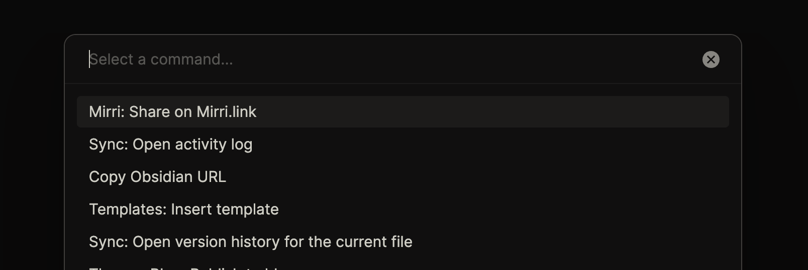

# Mirri for Obsidian

**Adds a command to upload a note via Mirri to Obsidian.**

This only shares the current note, and any linked media. Internal links to other markdown files in your vault will not be shared.

👉 [Download the latest release here](https://github.com/mirri-link/integration-obsidian/releases/latest)

